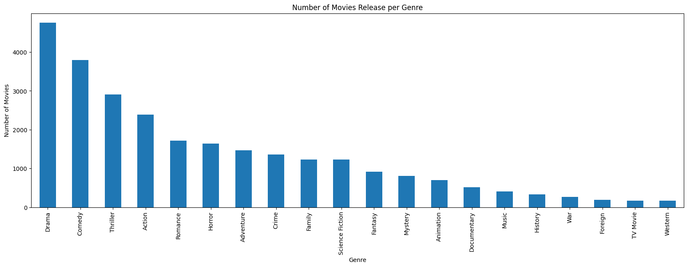
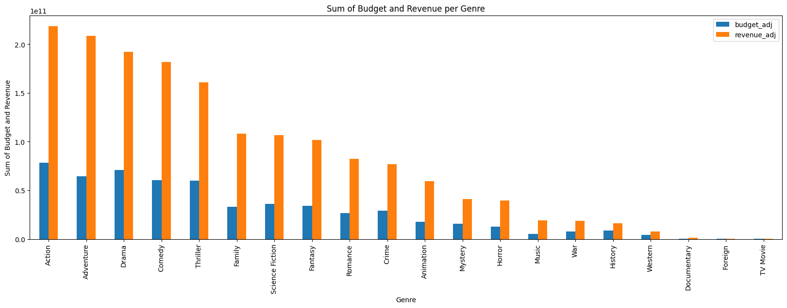
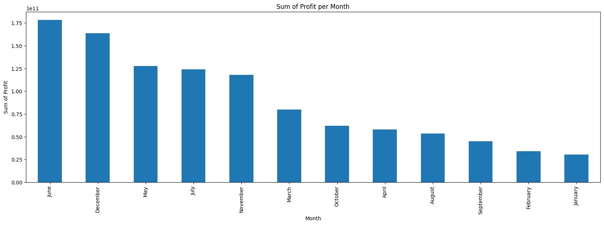

# Project: Investigate a Dataset - TMDb movie data

In this project, we will be analyzing the TMDb movie data. Our goal is to analyze the data and find out the answers to the following questions:

> Question 1: Which genre of movies are most popular across the years?

> Question 2: What genre of movie has highest budget and revenue?

> Question 3: Does popularity of the movie affect the profit?

## Table of Contents

-   [Project: Investigate a Dataset - TMDb movie data](#project-investigate-a-dataset---tmdb-movie-data)
    -   [Table of Contents](#table-of-contents)
    -   [Introduction](#introduction)
        -   [Dataset Description](#dataset-description)
    -   [How to run the project](#how-to-run-the-project)
    -   [Data Wrangling](#data-wrangling)
    -   [Data Cleaning](#data-cleaning)
    -   [Exploratory Data Analysis](#exploratory-data-analysis)
    -   [Conclusions](#conclusions)

## Introduction

### Dataset Description

The dataset consists of movies released on or before 2015. The dataset has variables which include `id`, `imdb_id`, `popularity`, `budget`, `revenue`, `original_title`, `cast`, `homepage`, `director`, `tagline`, `overview`, `runtime`, `genres`, `production_companies`, `release_date`, `vote_count`, `vote_average`, `release_year`, `budget_adj`, `revenue_adj`.

1. `id` - A unique identifier for each movie. **Will help to differentiate movies with same names**
2. `imdb_id` - A unique identifier for each movie assigned by IMBD **Has little significance and it will be dropped**
3. `popularity` - A numeric quantity showing how the movie is popular **This will be used to determine populality of the movie**
4. `budget` - the amount used in terms of money to make the movie **will be dropped and adjusted column used**
5. `revenue` - how much was earned from the movie **will be dropped and adjusted column used**
6. `original_title` - the title given to the movie
7. `cast` - the list of actors in the movie
8. `homepage` - a url of website where one can read about the movie **not significant in analysis will be dropped**
9. `director` - the director of the movie
10. `tagline` - a short descriptive statement about the movie
11. `overview` - A brief description of the movie
12. `runtime` - the running time of the movie in minutes
13. `genres` - the genre of the movie
14. `production_companies` - which company produced the movie
15. `release_date` - month date and the year the movie was released
16. `vote_count` - the count of votes recieved
17. `vote_average` - average rating the movie received
18. `release_year` - the year the movie was released
19. `budget_adj` - the is the budget adjusted to reflect the inflation
20. `revenue_adj` - the is the revenue adjusted to reflect the inflation

## How to run the project

To run the project, you need to have python installed on your computer. You can download python from [here](https://www.python.org/downloads/). After installing python, you need to install the following libraries:

1. `pandas`
2. `numpy`
3. `matplotlib`
4. `seaborn`
5. `datetime`

You can install the libraries by running the following command in your terminal:

```bash
pip install pandas numpy matplotlib seaborn datetime
```

In our project, we have used `jupyter notebook` to run the code. You can install `jupyter notebook` by running the following command in your terminal:

```bash
pip install jupyter
```

After installing the libraries, you can run the project by running the following command in your terminal:

```bash
jupyter notebook
```

We will be using pandas `explode()` function to split the data in the `genres` column. This function is available in pandas version 0.25.0 and above. If you are using an older version of pandas, you can update it by running the following command in your terminal:

```bash
pip install pandas --upgrade
```

## Data Wrangling

This section will describe the data wrangling process. We will be performing the following steps:

> Load the data into a pandas dataframe

```python
# Load your data and print out a few lines
df = pd.read_csv('./Database_TMDb_movie_data/tmdb-movies.csv')
```

> We will investigate the dataset to determine if there are any missing values, duplicate values, and any other issues that need to be addressed before we can proceed with the analysis. We will also drop the columns that are not significant in the analysis.
> For these steps, we will be using the following commands:

1. `df.shape` - to get the number of rows and columns in the dataset
2. `df.describe()` - to get the statistical information about the dataset
3. `df.info()` - to get the information about the dataset
4. `df.isnull().sum()` - to get the count of missing values in each column
5. `df.duplicated().sum()` - to get the count of duplicate values in the dataset
6. `df.nunique()` - to get the count of unique values in each column
7. `df.dtypes` - to get the data types of each column

## Data Cleaning

Upon executing the `df.info()` and `df.isnull().sum()` commands, it becomes evident that several columns, namely `homepage`, `director`, `tagline`, `overview`, `genres`, and `production_companies`, have missing values. Since these columns do not hold significant value in the analysis, we will eliminate them. Additionally, we will eliminate the `imdb_id` column as it is also not essential in the analysis. Additionally, we have identified a duplicated row in the dataset, which we will remove.

```python
# Drop the columns that are not needed. These columns are imdb_id, homepage, tagline, keywords, overview, budget, revenue, cast.
df.drop(['imdb_id', 'homepage', 'tagline', 'keywords', 'overview', 'budget', 'revenue', 'cast'], axis=1, inplace=True)

# Drop the duplicates.
df.drop_duplicates(inplace=True)
```

The `release_date` column is in string format. We will convert it to datetime format. This will help us to work with dates beter. We will also create a new column `profit` which will be the difference between `revenue_adj` and `budget_adj`.

```python
# Convert release_date to datetime format
df['release_date'] = pd.to_datetime(df['release_date'])

# Create a new column profit which is the difference between revenue_adj and budget_adj
df['profit'] = df['revenue_adj'] - df['budget_adj']
```

We will create a new column with month name from `release_date` column. This will help us to analyse the data based on month and determine the most popular month for movies and if movies released in a particular month are more profitable.

```python
# Create a new column month which will have the month name from release_date
df['month'] = df['release_date'].dt.month_name()
```

The `genres` column has multiple genres for a movie. We will split the genres and create a new row for each genre. This will help us to analyse the data based on genres and determine the most popular genre for movies and if movies of a particular genre are more profitable.

```python
# Split the genres column and create a new row for each genre
df_genres = df.copy()
df_genres = df_genres.assign(genres=df_genres['genres'].str.split('|')).explode('genres')
```

## Exploratory Data Analysis



> The most popular genre of movies is Drama while Western is the least popular genre of movies.



> The genre of movie with highest budget is Action followed closely by Drama while the genre of movie with highest revenue is Action. Based on these observations, we can see how the budget and revenue are related to the genre of the movie.
> 
> From the above plot, we can see month of release can affect the revenue. Movies released in the month of June are the most profitable. The least profitable month of release is January.

## Conclusions

After analysing the data, we can conclude the following:
The success of a movie can be determined by the genre of the movie. Movies of genre Adventure and Action are the most profitable. We have also seen that certain months of release can affect the revenue. Movies released in the month of June are the most profitable. The least profitable month of release is January. We have also seen that the popularity of the movies does not mean there will be a high profit. Movies with low popularity, when combined together, have the highest profit.

For a movie to be successful, it should also have a good budget, should be released in the month of June and should be of genre Adventure or Action.
